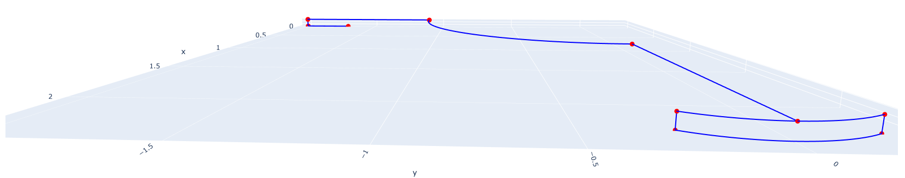
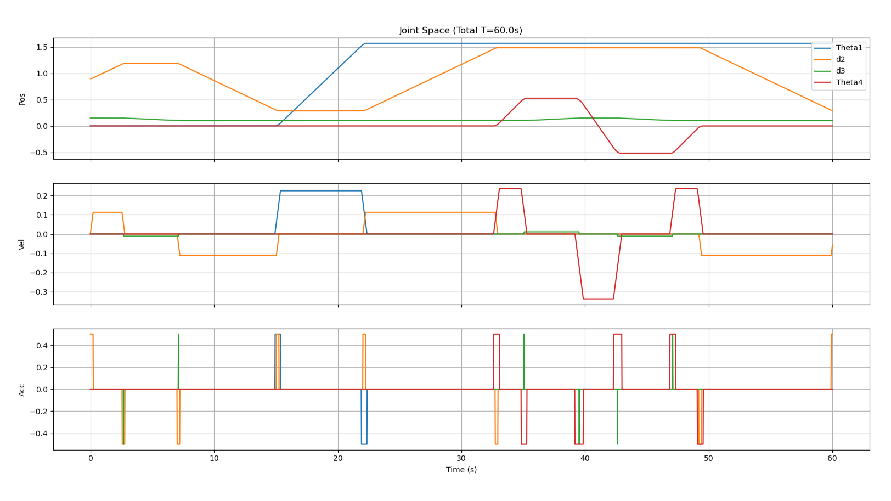
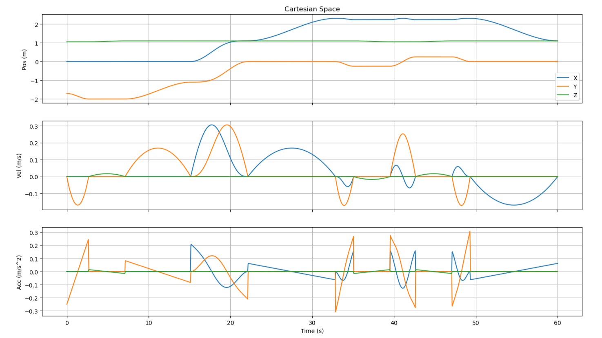
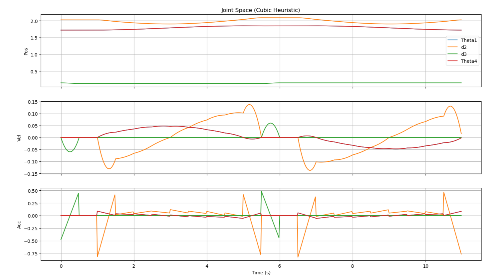

# Pizza-Robot: 4-DOF Kinematics & Trajectory Planning

This repository contains the complete kinematics modelling and trajectory planning framework for a custom 4-degree-of-freedom (4-DOF) robotic arm. Designed with a cylindrical R-P-P-R (Revolute-Prismatic-Prismatic-Revolute) topology, the robot is engineered to automate pizza handling tasks, including picking up dough, placing it in an oven, and executing complex turning manoeuvres.

## Manipulator Coordinate Logic

The robot's motion is governed by an analytical kinematic model. The coordinate frames are assigned according to standard Denavit-Hartenberg (DH) conventions.

### Denavit-Hartenberg Parameters

The kinematic chain is defined by the following parameters:

| Link | $\alpha_{m-1}$ | $a_{m-1}$ | $\theta_m$ | $d_m$ |
| --- | --- | --- | --- | --- |
| $0 \rightarrow 1$ | $0^\circ$ | 0 | $\theta_1$ | $H_1 + L_0$ |
| $1 \rightarrow 2$ | $+90^\circ$ | 0 | $0^\circ$ | $d_2 + L_1$ |
| $2 \rightarrow 3$ | $+90^\circ$ | A1 | $+90^\circ$ | $d_3 + (L_2 + H_4 + L_3)$ |
| $3 \rightarrow 4$ | $0^\circ$ | 0 | $\theta_4$ | 0 |
| $4 \rightarrow 5$ | $0^\circ$ | $L_4$ | $0^\circ$ | 0 |

### Forward Kinematics (Position Vectors)

By chaining the individual link transformation matrices, the final homogeneous transformation from the global base frame `{0}` to the end-effector frame `{5}` yields the following position vectors for the Tool Centre Point (TCP):

$$P_x = L_4\sin(\theta_1 - \theta_4) + A_1\cos\theta_1 + (d_2 + L_1)\sin\theta_1$$

$$P_y = -L_4\cos(\theta_1 - \theta_4) + A_1\sin\theta_1 - (d_2 + L_1)\cos\theta_1$$

$$P_z = (H_1 + L_0) - (d_3 + L_2 + H_4 + L_3)$$

### Inverse Kinematics

To determine the joint variables $q = [\theta_1, d_2, d_3, \theta_4]^T$ required to reach a desired end-effector pose, an analytical closed-form solver is implemented. By employing kinematic decoupling, the vertical displacement ($d_3$) is isolated from the planar motion, allowing for precise and computationally efficient joint angle calculations.

## Trajectory Planning

The robot's motion is evaluated using custom path-planning algorithms generated in both joint and Cartesian spaces.

### Method 1: Linear Segments with Parabolic Blends (LSPB)

Generates trapezoidal velocity profiles. While it ensures constant velocity during linear segments, it inherently results in step-changes in acceleration at the blend points.

### Method 2: Cubic Polynomials with Heuristic (CSH)

This method fits third-degree polynomials to trajectory segments. It utilises a "Tangent Heuristic" to calculate velocities at via points. If the slope changes sign, it forces the velocity to zero to prevent overshoot, resulting in a much smoother motion that successfully hits all via points.

### Application: Cartesian Pizza Turning

A specific $C^1$ continuous spatial manoeuvre designed to lift and rotate a pizza halfway. It converts a dense set of Cartesian waypoints into joint space using the analytical IK solver, then applies the CSH planner to achieve a smooth 3D arc.

## Tech Stack

* 
**Language:** Python 

* 
**Libraries:** NumPy, Matplotlib, Plotly 

* 
**Validation:** Verified against Peter Corke's Robotics Toolbox for Python.
